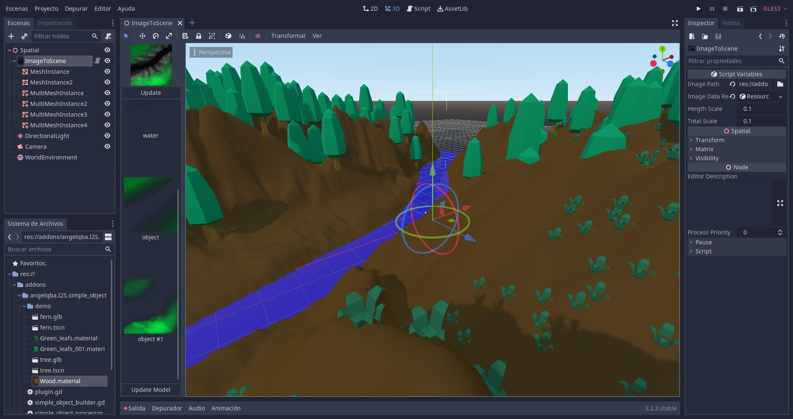

# Simple and extensible godot addon to convert TIFF image layers to MeshInstances


## How to use it:

Clone this repo and copy "addons" folder in your project.

Activate this plugin in Project Settings -> Plugins

Now you can create a ImageToScene node. 


When you select it, you can specify a image in TIFF format to be loaded.


You can find a sample image at res://addons/angelqba.image_to_scene/demo/image1.tiff

### Image Format

Images must be in TIFF format, uncompressed and all layers must have the same dimensions.
Also, layers must be called "terrain" or "water", for the included generator to work. Layers are expected to have this format: TYPE:PROCESSOR:BUILDER. Only type is required. Example: **terrain:SimpleTerrainProcessor:SimpleTerrainBuilder** or **terrain** or **terrain::SimpleTerrainBuilder**

I use Gimp to create and export them.
In the demo folder, are sample images to test.

### Configuring

Now you can see in the left panel, an image preview, a preview of each layer. 


Push the "Update Model" at the bottom. I recomend using 250x250 images to see how long does it take to generate the mesh.


### Layer Configuration

Some layer can be configured. If you activated the angelqba.I2S.simple_object addon, you can configure layers of type "object". Select a layer of type object, and a "Layer Inspector" panel will become available at the bottom.


In this case, you can set the Object (a scene file with a MeshInstance), the probability and the scale.


The final result.



## Extendig it

You can create your own processors and builders.
Basically, processors convert color info to coordinates. Builders use generated coordinates to create a MeshInstance.

Included in the addon, are a SimpleTerrainProcessor and a SimpleWaterProcessor. Also a SimpleTerrainBuilder and a SimpleWaterBuilder.

To add your own builder, for example, create a godot plugin, create a script the extends from "res://addons/angelqba.image_to_scene/builders/builder_interface.gd", reimplement what you want, and in you plugin, register it in the BuilderManager.

For example:
```python
tool
extends EditorPlugin

var object_processor: Node
var object_builder: Node
var registration_attempts = 10

func _enter_tree():
	# wait for the editor to load the main plugin
	get_tree().create_timer(1).connect("timeout", self, "register")
		
func register():
	var BuilderManager = get_tree().root.get_node("BuilderManager")
	var ProcessorManager = get_tree().root.get_node("ProcessorManager")
	
	object_builder = preload("res://addons/test/simple_object_builder.gd").new()
	object_processor = preload("res://addons/test/simple_object_processor.gd").new()
	
	if BuilderManager:
		# Register builders
		if not object_builder.builder_type in BuilderManager.builders:
			BuilderManager.builders[object_builder.builder_type] = {}
			
		BuilderManager.builders[object_builder.builder_type][object_builder.builder_name] = object_builder
		print('BuilderManager registered')
		
	else:
		print('No BuilderManager')
		if registration_attempts:
			registration_attempts -= 1
			get_tree().create_timer(1).connect("timeout", self, "register")
			return

	if ProcessorManager:
		# Register processors
		if not object_processor.processor_type in ProcessorManager.processors:
			ProcessorManager.processors[object_processor.processor_type] = {}
		
		ProcessorManager.processors[object_processor.processor_type][object_processor.processor_name] = object_processor
		print('ProcessorManager registered')
		
	else:
		print('No ProcessorManager')
		if registration_attempts:
			registration_attempts -= 1
			get_tree().create_timer(1).connect("timeout", self, "register")
			return

func _exit_tree():
	if object_builder:
		object_builder.queue_free()
		
	if object_processor:
		object_processor.queue_free()

```

Also, you could check the code of the included addon "angelqba.I2S.simple_object". It extends the functionality of the base addon to add a Simple Object Scatter functionality.

NOTE: Included assets in demo folder are from [Kenney](https://www.kenney.nl)

## TO DO:

- Integration with [HungryProton/scatter](https://github.com/HungryProton/scatter) addon for object placement.
- Material and other configurations in preview panel.