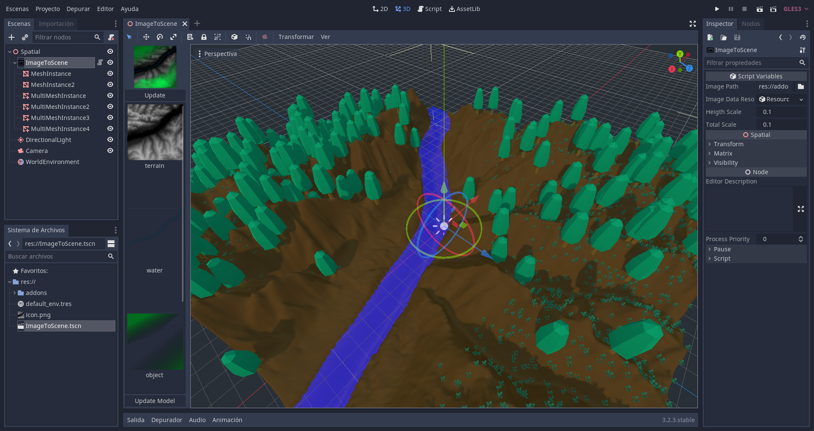

# Simple and extensible godot addon to convert TIFF image layers to MeshInstances



## Image Format

Images must be in TIFF format, uncompressed and all layers must have the same dimensions.
Also, layers must be called "terrain" or "water", for the included generator to work. Layers are expected to have this format: TYPE:PROCESSOR:BUILDER. Only type is required. Example: **terrain:SimpleTerrainProcessor:SimpleTerrainBuilder** or **terrain** or **terrain::SimpleTerrainBuilder**

I use Gimp to create and export them.
In the demo folder, are sample images to test.

## How to use it:

Clone this repo and copy "addons" folder in your project.

Activate this plugin in Project Settings -> Plugins

Now you can create a ImageToScene node. When you select it, you can specify a image in TIFF format to be loaded.

Now you can see in the left panel, an image preview, a preview of each layer. Push the "Update Model" at the bottom. I recomend using 250x250 images to see how long does it take to generate the mesh.


## Extendig it

You can create your own processors and builders.
Basically, processors convert color info to coordinates. Builders use generated coordinates to create a MeshInstance.

Included in the addon, are a SimpleTerrainProcessor and a SimpleWaterProcessor. Also a SimpleTerrainBuilder and a SimpleWaterBuilder.

To add your own builder, for example, create a godot plugin, create a script the extends from "res://addons/angelqba.image_to_scene/builders/builder_interface.gd", reimplement what you want, and in you plugin, register it in the BuilderManager.

For example:
```
# add builder to the "global" builder registry	
func register_builders():
	BuilderManager = get_tree().root.get_node("BuilderManager")
	
	# Register processors
	var builders = [
		preload("res://addons/angelqba.image_to_scene/builders/simple_terrain_builder.gd").new(),
		preload("res://addons/angelqba.image_to_scene/builders/simple_water_builder.gd").new()
	]
	
	for r in builders:
		BuilderManager.builders[r.builder_type][r.builder_name] = r
```

## TO DO:

- Integration with [HungryProton/scatter](https://github.com/HungryProton/scatter) addon for object placement.
- Material and other configurations in preview panel.